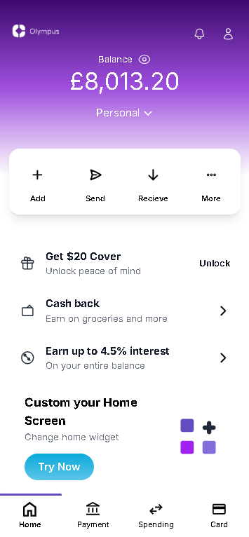

# [Olympus Mobile App Redesign]

Este projeto é uma recriação da interface de um aplicativo mobile, utilizando React para a estrutura do front-end e Tailwind CSS para a estilização, conforme proposto em um desafio de processo seletivo. O objetivo foi demonstrar domínio técnico em ambas as tecnologias, além de sensibilidade em UI/UX na definição de uma identidade visual e paleta de cores.

## ✨ Visão Geral

A interface original (em preto e branco) foi interpretada e redesenhada com foco em uma experiência de usuário moderna, limpa e intuitiva. A paleta de cores escolhida busca transmitir um senso de sofisticação e calma, com tons de roxo e cinza que complementam a funcionalidade do aplicativo.

## 🎨 Identidade Visual e Paleta de Cores

A paleta de cores foi definida para criar um ambiente visual agradável e coeso.

* **Roxo Vibrante (`#7B4BBF`):** Usado para elementos de destaque e como a cor principal do degradê no cabeçalho, transmitindo energia e modernidade.
* **Lilás Intermediário (`#9B79E1`):** Uma transição suave no degradê do cabeçalho, mantendo a harmonia.
* **Lilás Claro / Fundo (`#D4C7F5`):** A cor de fundo principal da aplicação, escolhida para ser leve e visualmente calma, permitindo que o conteúdo se destaque. Esta cor se mescla perfeitamente com a base do cabeçalho, criando uma sensação de continuidade.
* **Branco (`#FFFFFF`):** Utilizado para os cartões e superfícies que exigem clareza e destaque para o conteúdo, como a área das ações rápidas e a lista de vantagens.
* **Cinza Escuro / Preto (`#000000` / `text-gray-900`):** Para textos principais e ícones ativos, garantindo legibilidade.
* **Cinza Claro (`text-gray-500`):** Para textos secundários e ícones inativos, oferecendo contraste sutil.
* **Roxo Escuro (`#644BBF`):** Utilizado para detalhes como a barra de seleção na barra de navegação, alinhando-se à paleta principal.

## 🚀 Tecnologias Utilizadas

* **React:** Biblioteca JavaScript para construção de interfaces de usuário.
* **Tailwind CSS:** Framework CSS utility-first para estilização rápida e responsiva.

## 💻 Funcionalidades Implementadas

* **Cabeçalho Dinâmico:** Implementação de um cabeçalho com degradê de três cores que se mescla com a cor de fundo da página.
* **Controle de Visibilidade de Saldo:** Funcionalidade de "olho" para ocultar/mostrar o valor do saldo, aumentando a privacidade do usuário.
* **Navegação Inferior (NavBar):** Componente de navegação com ícones SVG inline e feedback visual (aumento de tamanho e barra de destaque) para o item ativo.
* **Cartão de Ações Rápidas:** Seção destacada para ações como "Adicionar", "Enviar", "Receber" e "Mais".
* **Lista de Vantagens/Promoções:** Componentes reutilizáveis para exibir vantagens com ícones e chamadas para ação.
* **Componentes Reutilizáveis:** Estrutura modular em React com componentes como `Balance`, `Notificacao`, `Perfil`, `SeletorConta`, `BarraAcoes`, `ListaVantagens`, `CartaoAcao`, `IconeWidget` e `NavBar`.

## 📦 Como Rodar o Projeto

Para executar este projeto em sua máquina local, siga os passos abaixo:

1.  **Clone o repositório:**
    ```bash
    git clone [https://github.com/LaraSouzx/DesafioFrontEnd.git](https://github.com/LaraSouzx/DesafioFrontEnd.git)
    cd [DesafioFrontEnd]
    ```
2.  **Instale as dependências:**
    ```bash
    npm install
    # ou
    yarn install
    ```
3.  **Inicie o servidor de desenvolvimento:**
    ```bash
    npm start
    # ou
    yarn start
    ```

    O aplicativo estará disponível em `http://localhost:3000` no seu navegador.

## 📸 Screenshot da Aplicação Finalizada



